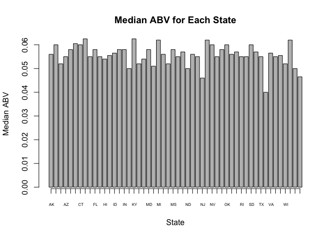
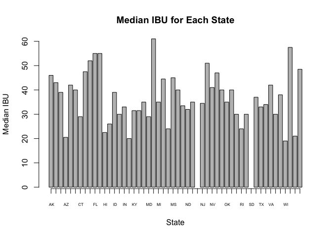

## INTRODUCTION
This is Case Study on Beers and Breweries. There are two datasets in this study: Beers and Breweries. The Beers dataset contains a list of 2410 US craft beers and Breweries dataset contains 558 US breweries. In this study the following questions are answered:
1) The number of breweries are present in each state
2) New data set is presented called beers_n_breweries. This new dataset is the merging of dataset Beers and Breweries.
3) The number of NA's in each column
4) Computing the median alcohol content and international bitterness unit for each state. 
5) State that has the maximum alcoholic (ABV) beer. State that has the most bitter (IBU) beer.
6) Summary statistics for the ABV variable
7) To report if there is an apparent relationship between the bitterness of the beer and its alcoholic content

## Reading the csv files


```r
breweries <- read.csv("https://raw.githubusercontent.com/tikisen/6306-case-study-1/master/Breweries.csv", quote = "", row.names = NULL, stringsAsFactors = FALSE, header = TRUE)
beers <- read.csv("https://raw.githubusercontent.com/tikisen/6306-case-study-1/master/Beers.csv", quote = "", row.names = NULL, stringsAsFactors = FALSE, header = TRUE)
```
## Question 1: The number of breweries present in each state


```r
library(plyr)
breweries_state <- count(breweries$State)
colnames(breweries_state) <- c("State", "Number of Breweries")
breweries_state
```

```
##              State Number of Breweries
## 1                                    1
## 2               AK                   7
## 3               AL                   3
## 4               AR                   2
## 5               AZ                  11
## 6               CA                  39
## 7               CO                  47
## 8               CT                   8
## 9               DC                   1
## 10              DE                   2
## 11              FL                  15
## 12              GA                   7
## 13              HI                   4
## 14              IA                   5
## 15              ID                   5
## 16              IL                  18
## 17              IN                  22
## 18              KS                   3
## 19              KY                   4
## 20              LA                   5
## 21              MA                  23
## 22              MD                   7
## 23              ME                   9
## 24              MI                  32
## 25              MN                  12
## 26              MO                   9
## 27              MS                   2
## 28              MT                   9
## 29              NC                  19
## 30              ND                   1
## 31              NE                   5
## 32              NH                   2
## 33              NJ                   3
## 34              NM                   4
## 35              NV                   2
## 36              NY                  16
## 37              OH                  15
## 38              OK                   6
## 39              OR                  29
## 40              PA                  25
## 41              RI                   5
## 42              SC                   4
## 43              SD                   1
## 44              TN                   3
## 45              TX                  28
## 46              UT                   4
## 47              VA                  16
## 48              VT                  10
## 49              WA                  23
## 50              WI                  20
## 51              WV                   1
## 52              WY                   4
## 53 North Woodstock                   1
```

## Question 2: Merging of Datasets
New data set is presented called beers_n_breweries. This new dataset is the merging of dataset Beers and Breweries.

```r
colnames(beers)[5] <- "Brew_ID"
beers2 <- merge.data.frame(beers, breweries, by = "Brew_ID")
colnames(beers2)[2] <- "Beers Name"
colnames(beers2)[8] <- "Breweries Name"
#Print the first 6 observation
head(beers2,6)
```

```
##   Brew_ID    Beers Name Beer_ID   ABV IBU
## 1       1  Get Together    2692 0.045  50
## 2       1 Maggie's Leap    2691 0.049  26
## 3       1    Wall's End    2690 0.048  19
## 4       1       Pumpion    2689 0.060  38
## 5       1    Stronghold    2688 0.060  25
## 6       1   Parapet ESB    2687 0.056  47
##                                 Style Ounces     Breweries Name
## 1                        American IPA     16 NorthGate Brewing 
## 2                  Milk / Sweet Stout     16 NorthGate Brewing 
## 3                   English Brown Ale     16 NorthGate Brewing 
## 4                         Pumpkin Ale     16 NorthGate Brewing 
## 5                     American Porter     16 NorthGate Brewing 
## 6 Extra Special / Strong Bitter (ESB)     16 NorthGate Brewing 
##          City State
## 1 Minneapolis    MN
## 2 Minneapolis    MN
## 3 Minneapolis    MN
## 4 Minneapolis    MN
## 5 Minneapolis    MN
## 6 Minneapolis    MN
```

```r
#Print the last 6 observation
tail(beers2,6)
```

```
##      Brew_ID                Beers Name Beer_ID   ABV IBU
## 2403     556             Pilsner Ukiah      98 0.055  NA
## 2404     557  Heinnieweisse Weissebier      52 0.049  NA
## 2405     557           Snapperhead IPA      51 0.068  NA
## 2406     557         Moo Thunder Stout      50 0.049  NA
## 2407     557         Porkslap Pale Ale      49 0.043  NA
## 2408     558 Urban Wilderness Pale Ale      30 0.049  NA
##                        Style Ounces                Breweries Name
## 2403         German Pilsener     12         Ukiah Brewing Company
## 2404              Hefeweizen     12       Butternuts Beer and Ale
## 2405            American IPA     12       Butternuts Beer and Ale
## 2406      Milk / Sweet Stout     12       Butternuts Beer and Ale
## 2407 American Pale Ale (APA)     12       Butternuts Beer and Ale
## 2408        English Pale Ale     12 Sleeping Lady Brewing Company
##               City State
## 2403         Ukiah    CA
## 2404 Garrattsville    NY
## 2405 Garrattsville    NY
## 2406 Garrattsville    NY
## 2407 Garrattsville    NY
## 2408     Anchorage    AK
```

## Question 3: The number of NA's in each column
The following are the report of the number of NA's in each column

```r
NA_Brew_ID <- sum(is.na(beers2$Brew_ID))
NA_Beers <- sum(is.na(beers2$`Beers Name`))
NA_Beer_ID <- sum(is.na(beers2$Beer_ID))
NA_ABV <- sum(is.na(beers2$ABV))
NA_IBU <- sum(is.na(beers2$IBU))
NA_Style <- sum(is.na(beers2$Style))
NA_Ounces <- sum(is.na(beers2$Ounces))
NA_Breweries <- sum(is.na(beers2$`Breweries Name`))
NA_City <- sum(is.na(beers2$City))
NA_State <- sum(is.na(beers2$State))
number_of_NA <- c(NA_Brew_ID, NA_Beers, NA_Beer_ID, NA_ABV, NA_IBU, NA_Style, NA_Ounces, NA_Breweries, NA_City, NA_State)
colnames_NA <- c("NA_Brew_ID", "NA_Beers", "NA_Beer_ID", "NA_ABV", "NA_IBU", "NA_Style", "NA_Ounces", "NA_Breweries", "NA_City", "NA_State")
df_NA <- data.frame(x=colnames_NA, y=number_of_NA)
colnames(df_NA) <- c("Type of NA", "Frequency")
df_NA
```

```
##      Type of NA Frequency
## 1    NA_Brew_ID         0
## 2      NA_Beers         0
## 3    NA_Beer_ID         0
## 4        NA_ABV        62
## 5        NA_IBU      1003
## 6      NA_Style         0
## 7     NA_Ounces         0
## 8  NA_Breweries         0
## 9       NA_City         0
## 10     NA_State         0
```

## QUestion 4: Median ABV and IBU in Plot
Computing the median alcohol content and international bitterness unit for each state.

```r
abv <- beers2[-which(is.na(beers2$ABV)), c(4,10)] #cleaning up NA for abv
ibu <- beers2[-which(is.na(beers2$IBU)), c(5,10)] #cleaning up NA for ibu
med_abv <- data.frame(tapply(abv$ABV, abv$State, median)) #calculate median for abv
med_ibu <- data.frame(tapply(ibu$IBU, ibu$State, median)) #calculate median for ibu
med_abv$state <- rownames(med_abv) #makes rownames to State column
med_ibu$state <- rownames(med_ibu)
colnames(med_ibu) <- c("Median IBU", "State") # changing the column names
colnames(med_abv) <- c("Median ABV", "State")
med_abv_ibu <- join(med_abv, med_ibu, by="State") #join abv and ibu median data
med_abv_ibu <- med_abv_ibu[,c(2,1,3)] #reordering the column
med_abv_ibu
```

```
##              State Median ABV Median IBU
## 1               AK     0.0560       46.0
## 2               AL     0.0600       43.0
## 3               AR     0.0520       39.0
## 4               AZ     0.0550       20.5
## 5               CA     0.0580       42.0
## 6               CO     0.0605       40.0
## 7               CT     0.0600       29.0
## 8               DC     0.0625       47.5
## 9               DE     0.0550       52.0
## 10              FL     0.0580       55.0
## 11              GA     0.0550       55.0
## 12              HI     0.0540       22.5
## 13              IA     0.0555       26.0
## 14              ID     0.0565       39.0
## 15              IL     0.0580       30.0
## 16              IN     0.0580       33.0
## 17              KS     0.0500       20.0
## 18              KY     0.0625       31.5
## 19              LA     0.0520       31.5
## 20              MA     0.0540       35.0
## 21              MD     0.0580       29.0
## 22              ME     0.0510       61.0
## 23              MI     0.0620       35.0
## 24              MN     0.0560       44.5
## 25              MO     0.0520       24.0
## 26              MS     0.0580       45.0
## 27              MT     0.0550       40.0
## 28              NC     0.0570       33.5
## 29              ND     0.0500       32.0
## 30              NE     0.0560       35.0
## 31              NH     0.0550         NA
## 32              NJ     0.0460       34.5
## 33              NM     0.0620       51.0
## 34              NV     0.0600       41.0
## 35              NY     0.0550       47.0
## 36              OH     0.0580       40.0
## 37              OK     0.0600       35.0
## 38              OR     0.0560       40.0
## 39              PA     0.0570       30.0
## 40              RI     0.0550       24.0
## 41              SC     0.0550       30.0
## 42              SD     0.0600         NA
## 43              TN     0.0570       37.0
## 44              TX     0.0550       33.0
## 45              UT     0.0400       34.0
## 46              VA     0.0565       42.0
## 47              VT     0.0550       30.0
## 48              WA     0.0555       38.0
## 49              WI     0.0520       19.0
## 50              WV     0.0620       57.5
## 51              WY     0.0500       21.0
## 52 North Woodstock     0.0465       48.5
```

```r
barplot(med_abv_ibu$`Median ABV`, names.arg = med_abv_ibu$State, axis.lty = 1, main="Median ABV for Each State", cex.names = 0.5, xlab="State", ylab="Median ABV")
```

<!-- -->

```r
barplot(med_abv_ibu$`Median IBU`, names.arg = med_abv_ibu$State, axis.lty = 1, main="Median IBU for Each State", cex.names = 0.5, xlab="State", ylab="Median IBU")
```

<!-- -->


## Question 5: Maximum ABV and IBU

```r
#State with Maximum ABV
beers2[which(beers2$ABV==max(beers2$ABV, na.rm = TRUE)),10]
```

```
## [1] " CO"
```

```r
#State with the most bitter (maximum IBU)
beers2[which(beers2$IBU==max(beers2$IBU, na.rm = TRUE)),10]
```

```
## [1] " OR"
```

## Question 6: Summary statistics for the ABV variable

```r
summary(beers2$ABV)
```

```
##    Min. 1st Qu.  Median    Mean 3rd Qu.    Max.    NA's 
## 0.00100 0.05000 0.05600 0.05978 0.06700 0.12800      62
```

## Question 7: Relationship between bitterness and alcoholic contents

```r
plot(beers2$IBU,beers2$ABV, main="Relationship between IBU and ABV of Beers", xlab="IBU", ylab="ABV")
```

<!-- -->

```r
#Fitting this to linear model

beers2.lm <- lm(beers2$IBU ~ beers2$ABV, data=beers2)
summary(beers2.lm)
```

```
## 
## Call:
## lm(formula = beers2$IBU ~ beers2$ABV, data = beers2)
## 
## Residuals:
##     Min      1Q  Median      3Q     Max 
## -78.849 -11.977  -0.721  13.997  93.458 
## 
## Coefficients:
##             Estimate Std. Error t value Pr(>|t|)    
## (Intercept)  -34.099      2.326  -14.66   <2e-16 ***
## beers2$ABV  1282.037     37.860   33.86   <2e-16 ***
## ---
## Signif. codes:  0 '***' 0.001 '**' 0.01 '*' 0.05 '.' 0.1 ' ' 1
## 
## Residual standard error: 19.26 on 1403 degrees of freedom
##   (1003 observations deleted due to missingness)
## Multiple R-squared:  0.4497,	Adjusted R-squared:  0.4493 
## F-statistic:  1147 on 1 and 1403 DF,  p-value: < 2.2e-16
```
