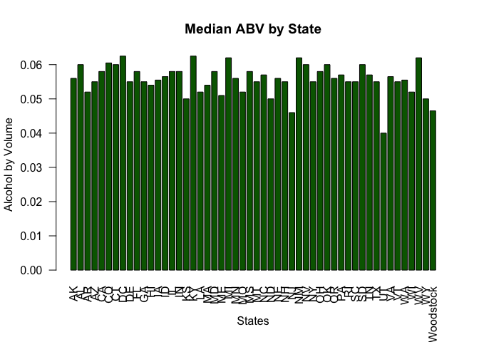

## INTRODUCTION
This is Case Study on Beers and Breweries. There are two datasets in this study: Beers and Breweries. The Beers dataset contains a list of 2410 US craft beers and Breweries dataset contains 558 US breweries. 

As you're trying to start a craft brewery chain and it's important to know what the market for such items would be. We analyze your data on beers and breweries. Here are some results of some analysis to help build the market analysis for the business plan.

In this analysis, the following questions are answered for your consideration:
1. The number of breweries are present in each state
2. New data set is presented called beers_n_breweries. This new dataset is the merging of dataset Beers and Breweries.
3. The number of NA's in each column
4. Computing the median alcohol content and international bitterness unit for each state. 
5. State that has the maximum alcoholic (ABV) beer. State that has the most bitter (IBU) beer.
6. Summary statistics for the ABV variable
7. To report if there is an apparent relationship between the bitterness of the beer and its alcoholic content


## Reading the csv files


```r
breweries <- read.csv("https://raw.githubusercontent.com/tikisen/6306-case-study-1/master/Breweries.csv", quote = "", row.names = NULL, stringsAsFactors = FALSE, header = TRUE)
beers <- read.csv("https://raw.githubusercontent.com/tikisen/6306-case-study-1/master/Beers.csv", quote = "", row.names = NULL, stringsAsFactors = FALSE, header = TRUE)
```
### 1. This code calculates the number of breweries present in each state.


```r
library(plyr)
breweries_state <- count(breweries$State)
colnames(breweries_state) <- c("State", "Number of Breweries")
breweries_state
```

```
##              State Number of Breweries
## 1                                    1
## 2               AK                   7
## 3               AL                   3
## 4               AR                   2
## 5               AZ                  11
## 6               CA                  39
## 7               CO                  47
## 8               CT                   8
## 9               DC                   1
## 10              DE                   2
## 11              FL                  15
## 12              GA                   7
## 13              HI                   4
## 14              IA                   5
## 15              ID                   5
## 16              IL                  18
## 17              IN                  22
## 18              KS                   3
## 19              KY                   4
## 20              LA                   5
## 21              MA                  23
## 22              MD                   7
## 23              ME                   9
## 24              MI                  32
## 25              MN                  12
## 26              MO                   9
## 27              MS                   2
## 28              MT                   9
## 29              NC                  19
## 30              ND                   1
## 31              NE                   5
## 32              NH                   2
## 33              NJ                   3
## 34              NM                   4
## 35              NV                   2
## 36              NY                  16
## 37              OH                  15
## 38              OK                   6
## 39              OR                  29
## 40              PA                  25
## 41              RI                   5
## 42              SC                   4
## 43              SD                   1
## 44              TN                   3
## 45              TX                  28
## 46              UT                   4
## 47              VA                  16
## 48              VT                  10
## 49              WA                  23
## 50              WI                  20
## 51              WV                   1
## 52              WY                   4
## 53 North Woodstock                   1
```

### 2. Merging of Datasets
This code is used to combine the two data sets we were given into one called beers2. This new dataset is the merging of dataset Beers and Breweries. We also rename two columns both named Name. We change the one from the Beers data set to Beers Name and the one from the Breweries data set to Breweries Name.

Finally we use some code to show the first six and last six observations.

```r
colnames(beers)[5] <- "Brew_ID"
beers2 <- merge.data.frame(beers, breweries, by = "Brew_ID")
colnames(beers2)[2] <- "Beers Name"
colnames(beers2)[8] <- "Breweries Name"
#Print the first 6 observation
head(beers2,6)
```

```
##   Brew_ID    Beers Name Beer_ID   ABV IBU
## 1       1  Get Together    2692 0.045  50
## 2       1 Maggie's Leap    2691 0.049  26
## 3       1    Wall's End    2690 0.048  19
## 4       1       Pumpion    2689 0.060  38
## 5       1    Stronghold    2688 0.060  25
## 6       1   Parapet ESB    2687 0.056  47
##                                 Style Ounces     Breweries Name
## 1                        American IPA     16 NorthGate Brewing 
## 2                  Milk / Sweet Stout     16 NorthGate Brewing 
## 3                   English Brown Ale     16 NorthGate Brewing 
## 4                         Pumpkin Ale     16 NorthGate Brewing 
## 5                     American Porter     16 NorthGate Brewing 
## 6 Extra Special / Strong Bitter (ESB)     16 NorthGate Brewing 
##          City State
## 1 Minneapolis    MN
## 2 Minneapolis    MN
## 3 Minneapolis    MN
## 4 Minneapolis    MN
## 5 Minneapolis    MN
## 6 Minneapolis    MN
```

```r
#Print the last 6 observation
tail(beers2,6)
```

```
##      Brew_ID                Beers Name Beer_ID   ABV IBU
## 2403     556             Pilsner Ukiah      98 0.055  NA
## 2404     557  Heinnieweisse Weissebier      52 0.049  NA
## 2405     557           Snapperhead IPA      51 0.068  NA
## 2406     557         Moo Thunder Stout      50 0.049  NA
## 2407     557         Porkslap Pale Ale      49 0.043  NA
## 2408     558 Urban Wilderness Pale Ale      30 0.049  NA
##                        Style Ounces                Breweries Name
## 2403         German Pilsener     12         Ukiah Brewing Company
## 2404              Hefeweizen     12       Butternuts Beer and Ale
## 2405            American IPA     12       Butternuts Beer and Ale
## 2406      Milk / Sweet Stout     12       Butternuts Beer and Ale
## 2407 American Pale Ale (APA)     12       Butternuts Beer and Ale
## 2408        English Pale Ale     12 Sleeping Lady Brewing Company
##               City State
## 2403         Ukiah    CA
## 2404 Garrattsville    NY
## 2405 Garrattsville    NY
## 2406 Garrattsville    NY
## 2407 Garrattsville    NY
## 2408     Anchorage    AK
```
  
### 3. This code will report the number of NA's in each column.  

```r
colSums(is.na(beers2))
```

```
##        Brew_ID     Beers Name        Beer_ID            ABV            IBU 
##              0              0              0             62           1003 
##          Style         Ounces Breweries Name           City          State 
##              0              0              0              0              0
```

### 4. This code will compute the median alcohol content and international bitterness unit for each state and plot a bar chart to compare.


```r
abv<-na.omit(beers2$ABV)
ibu<-na.omit(beers2$IBU)
median(abv)
```

```
## [1] 0.056
```

```r
median(ibu)
```

```
## [1] 35
```

```r
median_ABV <- aggregate(ABV~State, beers2, FUN = median)
barplot(median_ABV$ABV, 
        space = .25, 
        xlab = "States", 
        ylab = "Alcohol by Volume", 
        main = "Median ABV by State", 
        names.arg = median_ABV$State, 
        las=2)
```

<!-- -->

```r
median_IBU <- aggregate(IBU~State, beers2, FUN = median)
barplot(median_IBU$IBU, 
        space = .25, 
        xlab = "States", 
        ylab = "Bitterness", 
        main = "Median IBU by State", 
        names.arg = median_IBU$State, 
        las=2)
```

<!-- -->


### 5. This code will look in the merged file to determine which state has the maximum alcoholic (ABV) beer and which state has the most bitter (IBU) beer.


```r
beers2$State[which.max(beers2$ABV)]
```

```
## [1] " CO"
```

```r
beers2$State[which.max(beers2$IBU)]
```

```
## [1] " OR"
```
The state with the beer with the highest alcohol by volume is Colorado. The state with the beer with the most bitter beer is Oregon.

### 6. Here is some code to produce some summary statistics for the ABV of the beers.


```r
summary(beers2$ABV)
```

```
##    Min. 1st Qu.  Median    Mean 3rd Qu.    Max.    NA's 
## 0.00100 0.05000 0.05600 0.05978 0.06700 0.12800      62
```
The lowest ABV is 0.1%, the highest is 12.8%. The average is 5.98% and the middle value is 5.6%. The alcohol content is unreported for 62 beers.

### 7. Is there an apparent relationship between the bitterness of the beer and its alcoholic content? Draw a scatter plot.

```r
regline <- lm(beers2$ABV~beers2$IBU,data=beers2) 
	summary(regline)
```

```
## 
## Call:
## lm(formula = beers2$ABV ~ beers2$IBU, data = beers2)
## 
## Residuals:
##       Min        1Q    Median        3Q       Max 
## -0.033288 -0.005946 -0.001595  0.004022  0.052006 
## 
## Coefficients:
##              Estimate Std. Error t value Pr(>|t|)    
## (Intercept) 4.493e-02  5.177e-04   86.79   <2e-16 ***
## beers2$IBU  3.508e-04  1.036e-05   33.86   <2e-16 ***
## ---
## Signif. codes:  0 '***' 0.001 '**' 0.01 '*' 0.05 '.' 0.1 ' ' 1
## 
## Residual standard error: 0.01007 on 1403 degrees of freedom
##   (1003 observations deleted due to missingness)
## Multiple R-squared:  0.4497,	Adjusted R-squared:  0.4493 
## F-statistic:  1147 on 1 and 1403 DF,  p-value: < 2.2e-16
```

```r
	with(beers2,plot(beers2$IBU, beers2$ABV,xlab="IBU",ylab="ABV",main="IBU vs. ABV",col="darkgreen"))
	abline(regline,col="red",lwd=3)
```

<!-- -->
Upon reviewing the scatter plot containing all ABV and IBU values, it is difficult to discern a pattern due to the fluctuations in data (resulting in a clustered effect) and various outliers. However, upon further visual inspection, the group believes there may be a correlation between alcohol content and bitterness.
